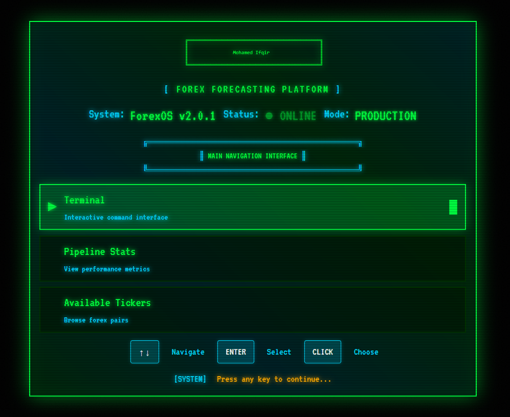
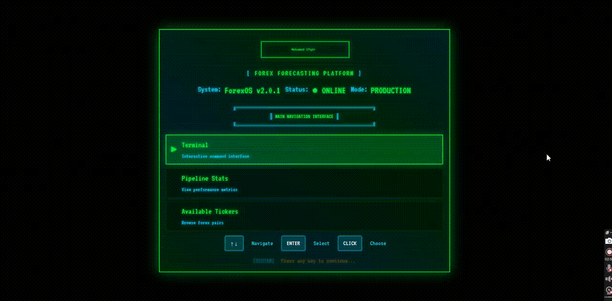

# Forex Time Series Forecasting — Production MLOps Pipeline



This repository implements a complete, production-oriented MLOps pipeline for foreign exchange (FX) rate forecasting. It bridges offline model training (data → features → tuning → serving) with a real-time streaming architecture (yfinance → Kafka → WebSocket). The system tracks experiments via MLflow, serves models via ONNX and FastAPI, and scales horizontally using Kafka for durable, partitioned message passing.

**Repository:** https://github.com/MohamedIKenedy/Forex-Time-Series-Forecasting.git

## Overview: What This Does

**Offline Training & Experimentation:**
- Fetches historical FX candles from Yahoo Finance for 10+ currency pairs
- Engineers 200+ features (lagged returns, rolling statistics, cross-ticker correlations) with zero data leakage
- Tunes gradient boosting models using Ray Tune (distributed hyperparameter search) and logs all runs to MLflow
- Exports trained models as ONNX for portable, efficient serving
- Evaluates using proper time-series cross-validation (no forward-looking information leaks)

**Real-Time Streaming & Serving:**
- Polls market data at configurable intervals (1-minute, hourly, daily) via yfinance
- Publishes candles to partitioned Kafka topics (deterministic per-ticker routing)
- Consumes from Kafka in background threads and broadcasts updates via WebSocket to connected clients
- Caches latest candles in memory (O(1) lookups by ticker/partition) and Redis (cross-instance coordination)
- Reconstructs recent history on-demand for inference via a `FeatureStore` backed by Kafka

**Deployment & Operations:**
- Single docker-compose stack for local development (FastAPI, Kafka, MLflow, Redis)
- Containerized service that scales horizontally (each instance handles its own WebSocket clients; Kafka fan-out ensures all get the same updates)
- Health checks and graceful shutdown for reliable rolling upgrades

## Architecture at a Glance

```
┌───────────────────────────────────────────────────────────────────┐
│                        Real-Time Path                             │
│                                                                   │
│  yfinance  →  StreamingService  →  Kafka Topics  →  Bridge        │
│              (blocking/thread)     (durable)      (thread)        │
│                                                       ↓           │
│                                   Cache + Broadcast (async core)  │
│                                             ↓                     │
│                                         WebSocket → Browser       │
└───────────────────────────────────────────────────────────────────┘

┌───────────────────────────────────────────────────────────────────┐
│                    Offline Training Path                          │
│                                                                   │
│  yfinance  →  Feature Engineering  →  Ray Tune / GBM              │
│   (historical)  (lagged returns,    (hyperparameter search)       │
│                  rolling stats)         ↓                         │
│                                    MLflow Tracking                │
│                                    ONNX Export                    │
│                                         ↓                         │
│                                  inference_models/  (models)      │
└───────────────────────────────────────────────────────────────────┘
```

## Core Components

**Data Ingestion & Streaming (`api/services/streaming_service.py`):**
- Three modes: instant (1m/2m + sub-minute tick quotes), hourly, daily
- Deduplicates repeated candles (same timestamp & close = skip)
- Publishes to Kafka topics keyed by ticker for in-partition ordering

**Message Bus (`api/services/kafka_service.py`):**
- Creates/expands topics with configurable partition counts
- Deterministic partitioning via CRC32(ticker) ensures same ticker always lands on same partition
- Producer config: `acks='all'`, `max_in_flight_requests=1` for durability and ordering

**Consumer Bridge (`api/services/kafka_bridge.py`):**
- Runs in background thread; does not block the async event loop
- Deserializes messages and invokes handlers to update cache and schedule broadcasts

**Cache & Broadcast (`api/services/utils/stream_utils.py` & `api/services/conn_management.py`):**
- In-memory `latest_data_cache[ticker][period_interval]` for O(1) reads
- `ConnectionManager` uses a set for O(1) WebSocket add/remove
- Broadcasts scheduled via `asyncio.run_coroutine_threadsafe()` from workers to the async core

**Feature Engineering (`api/services/features_services.py`):**
- On-demand reconstruction of recent history from Kafka topics
- Computes lags, log returns, rolling stats, forward fills missing values
- Used by both offline training and online inference paths

**Model Serving (`api/services/inference_services.py` & `api/services/predictor.py`):**
- Loads ONNX models and scalers from `inference_models/`; caches in memory to avoid repeated I/O
- For production: run in separate process/container to avoid blocking broadcasts

**Auxiliary Services:**
- `api/services/cache_services.py`: Redis-backed TTL caching for latest prices (cross-instance coordination)
- `api/models/forex.py`: ORM/schema definitions
- `api/routes/`: REST endpoints for health, data, stream control, inference

## Tech Stack

|         Layer           |          Technology                  |
|-------------------------|--------------------------------------|
| **Web & Async**         | FastAPI, Uvicorn, asyncio, React ts  |
| **Data & ETL**          | pandas, numpy, yfinance, Postgres,   |
|                         |           Spark, AWS S3              |
| **Streaming**           | Kafka (kafka-python), Redis          |
| **ML Training**         | GBM, scikit-learn, Torch, Ray Tune   |
| **Experiment Tracking** | MLflow                               |
| **Model Serving**       | ONNX Runtime                         |
| **Containerization**    | Docker, docker-compose               |
| **CI/CD**               | Github Actions, PyTest (for testing) |

## Quick Start

### Prerequisites

- Docker & Docker Compose (recommended) or Python 3.9+
- Git

### 1. Clone and Navigate

```bash
git clone https://github.com/MohamedIKenedy/Forex-Time-Series-Forecasting.git
cd Forex-Time-Series-Forecasting
```

### 2. Start the Full Stack (Docker Compose)

```bash
docker-compose up -d
```

This starts:
- **FastAPI** (http://localhost:8000) with WebSocket support
- **Kafka** (localhost:9092) for message streaming
- **MLflow** (http://localhost:5000) for experiment tracking by running `mlflow ui --port 5000 --host 0.0.0.0`

### 3. Access Dashboards

- **API Docs:** http://localhost:8000/docs (Swagger UI)
- **MLflow UI:** http://localhost:5000 (view training runs & artifacts)

### 4. Start Streaming (if not auto-started)

```bash
curl -X POST http://localhost:8000/stream/start_instant_streaming \
  -H "Content-Type: application/json" \
  -d '{"tickers": ["EURUSD=X", "GBPUSD=X", "USDJPY=X"]}'
```

### 5. Open WebSocket Client

Use the frontend at `ui/forex-dash/` (already served via docker-compose) or connect to `ws://localhost:8000/stream/ws` from a client.

## Demo Video

Watch the system in action:


Check the full video on YouTube:


Clickable YouTube thumbnail (opens the video in a new tab)
[](https://youtu.be/j9E-c5DrYDQ)

**What the demo covers:**
- Starting the streaming pipeline and connecting to WebSocket
- Real-time price updates flowing through Kafka to the web dashboard
- Running model inference and viewing predictions
- Exploring MLflow experiment tracking and comparing model runs
- Monitoring system health and Kafka topic metrics

## Local Development (Without Docker)

### Install Dependencies

```bash
python -m venv .venv
source .venv/bin/activate  # On Windows: .venv\Scripts\activate

pip install -r api/requirements.txt
```

### Run API

```bash
cd api
uvicorn main:app --reload --host 0.0.0.0 --port 8000
```

### Run Training/Tuning

```bash
cd Notebooks
jupyter notebook forex_forecasting.ipynb
# or
python -m jupyter lab
```

## Configuration

All configuration is driven by environment variables (see `api/config.py`). Key variables:

```bash
# Kafka
KAFKA_BROKERS=localhost:9092

# Redis (for caching)
REDIS_URL=redis://localhost:6379/0

# Streaming mode (auto, direct, kafka)
WS_UPDATES_MODE=kafka

# MLflow
MLFLOW_TRACKING_URI=http://localhost:5000

# API
API_HOST=0.0.0.0
API_PORT=8000
```

## Common Tasks

### Run Model Training with Hyperparameter Tuning

```bash
cd Notebooks
# Edit config in forex_forecasting.ipynb, then run all cells
# Experiments are logged to MLflow (http://localhost:5000)
```

### Start Real-Time Streaming for a Ticker

```bash
curl -X POST http://localhost:8000/stream/start_instant_streaming \
  -H "Content-Type: application/json" \
  -d '{"tickers": ["EURUSD=X", "GBPUSD=X"]}'
```

### Get Latest Price from Cache

```bash
curl http://localhost:8000/data/latest/EURUSD=X
```

### Run Inference (Predict Next Movement)

```bash
curl -X POST http://localhost:8000/inference/predict \
  -H "Content-Type: application/json" \
  -d '{"ticker": "EURUSD=X"}'
```

### View Experiment Results

Navigate to http://localhost:5000 → click on a run → view metrics, parameters, and exported model artifacts.

## Monitoring & Observability

- **Latency Tracking:** Instrument end-to-end latency from produce → consume → broadcast
- **Logs:** Check container logs via `docker-compose logs -f api`
- **Health Check:** `curl http://localhost:8000/health`
- **Kafka Status:** Monitor via Kafka admin tools (e.g., `kafka-topics.sh`, `kafka-consumer-groups.sh`)

## Contributing

1. Fork the repository
2. Create a feature branch: `git checkout -b feature/my-feature`
3. Implement changes with tests
4. Format with `black` and lint with `flake8`
5. Submit a pull request

## License

MIT License — see `LICENSE` for details.

## Disclaimer

This system is for research and educational purposes. Do **not** use for live trading without extensive backtesting, risk management, and validation. Past performance does not guarantee future results.

---

**For questions or issues**, open a GitHub issue or reach out via the project repository.
